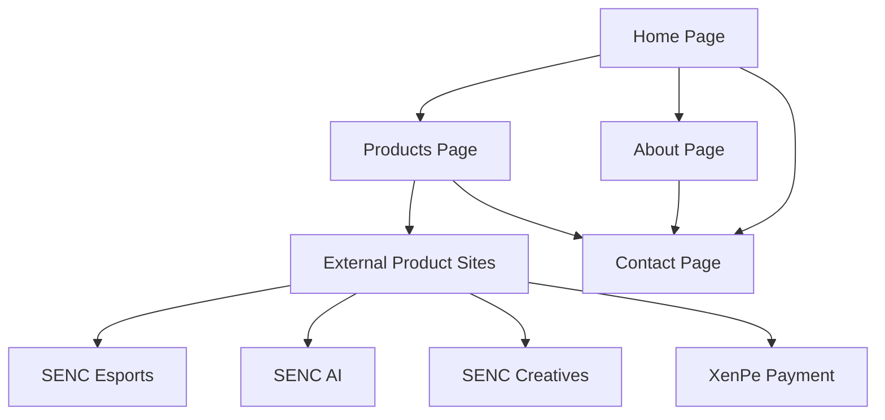

# SENC Main Website - Product Requirements Document

## 1. Product Overview
SENC Main Website serves as the central hub showcasing SENC's diverse product portfolio, allowing visitors to discover and navigate to various SENC offerings including esports, AI solutions, creative services, and payment solutions.

The website aims to establish SENC as a comprehensive technology company with multiple specialized divisions, providing clear pathways for visitors to explore relevant products based on their interests and needs.

## 2. Core Features

### 2.1 Feature Module
Our SENC main website consists of the following essential pages:
1. **Home page**: hero section with company overview, featured products showcase, navigation menu.
2. **Products page**: comprehensive product portfolio display, product categories, direct links to product websites.
3. **About page**: company information, mission and vision, team overview.
4. **Contact page**: contact information, inquiry form, office locations.

### 2.2 Page Details

| Page Name | Module Name | Feature description |
|-----------|-------------|---------------------|
| Home page | Hero section | Display SENC brand identity with compelling tagline and visual elements showcasing company's technological expertise |
| Home page | Featured products | Highlight key products (Esports, AI, Creatives, XenPe) with brief descriptions and call-to-action buttons |
| Home page | Navigation menu | Provide easy access to all main sections and external product websites |
| Products page | Product showcase | Display all SENC products with detailed descriptions, key features, and direct links to respective websites |
| Products page | Product categories | Organize products by industry (Gaming/Esports, Technology/AI, Creative Services, Financial Technology) |
| About page | Company overview | Present SENC's history, mission, vision, and core values |
| About page | Team section | Showcase key team members and leadership |
| Contact page | Contact form | Allow visitors to submit inquiries with name, email, subject, and message fields |
| Contact page | Contact information | Display office addresses, phone numbers, and email addresses |

## 3. Core Process

Visitors typically follow this flow: they arrive at the homepage where they get an overview of SENC and its key products, then navigate to the products page to explore specific offerings in detail, and finally visit external product websites or contact SENC for more information.

## 4. User Interface Design

### 4.1 Design Style
- **Primary colors**: Deep blue (#1a365d) and vibrant cyan (#00d4ff) representing technology and innovation
- **Secondary colors**: White (#ffffff) and light gray (#f7fafc) for clean backgrounds
- **Button style**: Modern rounded buttons with subtle shadows and hover effects
- **Font**: Clean sans-serif fonts like Inter or Roboto, with 16px base size for body text and larger sizes for headings
- **Layout style**: Card-based design with clean grid layouts and ample white space
- **Icon style**: Modern outline icons with consistent stroke width, complemented by relevant technology-themed illustrations

### 4.2 Page Design Overview

| Page Name | Module Name | UI Elements |
|-----------|-------------|-------------|
| Home page | Hero section | Full-width banner with gradient background, large typography, animated elements, and prominent CTA button |
| Home page | Featured products | Grid layout with product cards featuring icons, titles, descriptions, and "Learn More" buttons |
| Home page | Navigation menu | Horizontal navigation bar with dropdown menus for product categories and smooth scrolling effects |
| Products page | Product showcase | Detailed product cards with larger images, comprehensive descriptions, feature lists, and external link buttons |
| Products page | Product categories | Tabbed interface or filter system allowing visitors to browse products by category |
| About page | Company overview | Split layout with text content and supporting visuals, timeline for company history |
| About page | Team section | Grid of team member cards with photos, names, titles, and brief bios |
| Contact page | Contact form | Clean form design with proper validation, success/error states, and clear field labels |
| Contact page | Contact information | Organized layout with icons, maps integration, and clickable contact details |

### 4.3 Responsiveness
The website is designed mobile-first with full responsiveness across all devices, featuring touch-optimized interactions for mobile users and adaptive layouts that work seamlessly on desktop, tablet, and mobile screens.